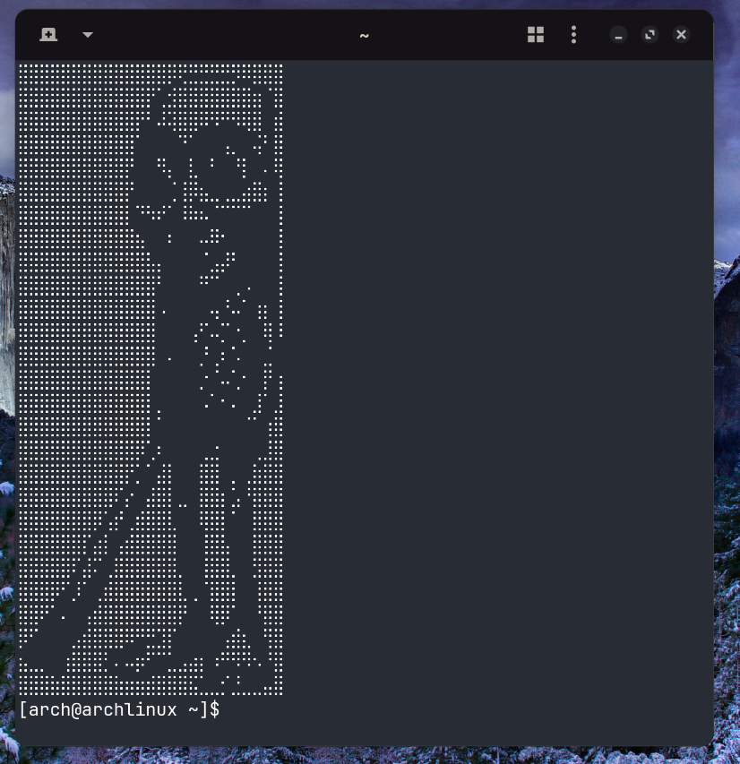

# Triple-T-erminal



A script that allows you to get tung tung spawn on your terminal. Supports every os.

---

## what this is

this is a tiny cursed tool that makes your terminal wake up every time it starts and remind you that tung tung exists.

you install it once and then every new terminal session becomes slightly less normal.

works on:

* linux
* mac
* windows
* fish enjoyers
* cmd users living in 2009

---

## what it does

on every terminal start it prints:

```
⣿⣿⣿⣿⣿⣿⣿⣿⣿⣿⣿⣿⣿⣿⡿⢟⣛⣛⣛⣛⡻⠿⣿⣿⣿
⣿⣿⣿⣿⣿⣿⣿⣿⣿⣿⣿⣿⡟⢁⣺⣿⣿⣿⣿⣿⣿⣿⣶⠈⣿
⣿⣿⣿⣿⣿⣿⣿⣿⣿⣿⣿⡟⠃⠼⢽⣿⣿⠿⠻⠛⠻⢿⣿⠀⣾
⣿⣿⣿⣿⣿⣿⣿⣿⣿⣿⣿⠁⠀⠀⠀⠙⠁⠀⠀⢠⡀⠀⢬⠃⣿
⣿⣿⣿⣿⣿⣿⣿⣿⣿⣿⡟⠀⠀⠻⡄⠀⣇⠀⠃⠀⠘⡇⠀⠄⢿
⣿⣿⣿⣿⣿⣿⣿⣿⣿⣿⡟⠀⠀⠀⢈⢸⡿⣦⣀⢀⣀⣴⣿⡆⢸
⣿⣿⣿⣿⣿⣿⣿⣿⣿⣿⡇⠙⠳⠞⠁⠸⠷⠦⠈⠉⠉⠉⠀⠀⢸
⣿⣿⣿⣿⣿⣿⣿⣿⣿⣿⣿⣦⠀⠀⠆⠀⠀⠤⠿⠂⠀⠀⠀⠀⢸
⣿⣿⣿⣿⣿⣿⣿⣿⣿⣿⣿⣿⣧⡄⠀⠀⠀⠈⣠⡼⠃⠀⠀⠀⢸
⣿⣿⣿⣿⣿⣿⣿⣿⣿⣿⣿⣿⣿⠃⠀⠀⠀⠛⠉⠀⢀⠠⠀⠀⢸
⣿⣿⣿⣿⣿⣿⣿⣿⣿⣿⣿⣿⣿⠠⠀⠀⠀⠀⢤⠘⠤⠁⢰⡆⢸
⣿⣿⣿⣿⣿⣿⣿⣿⣿⣿⣿⣿⣿⠀⠀⠀⢠⠋⠤⡉⠐⡀⠀⢿⠸
⣿⣿⣿⣿⣿⣿⣿⣿⣿⣿⣿⣿⣿⠀⠄⠀⠀⡘⢀⠆⠡⠀⠀⣈⠀
⣿⣿⣿⣿⣿⣿⣿⣿⣿⣿⣿⣿⡇⠀⠀⠀⠀⡐⠈⠤⢁⠂⠀⡟⢰
⣿⣿⣿⣿⣿⣿⣿⣿⣿⣿⣿⣿⡇⡀⠀⠀⠀⠠⠁⠂⠄⠀⣸⠁⣸
⣿⣿⣿⣿⣿⣿⣿⣿⣿⣿⣿⣿⡇⠁⠀⠀⠀⠀⠀⠀⠀⠈⠁⢰⣿
⣿⣿⣿⣿⣿⣿⣿⣿⣿⣿⣿⡿⢁⠆⠀⠀⠀⢀⣐⠀⠀⠀⢀⣸⣿
⣿⣿⣿⣿⣿⣿⣿⣿⣿⣿⡟⡁⠁⣼⡇⠀⠀⣿⣿⠀⡀⢀⣷⣿⣿
⣿⣿⣿⣿⣿⣿⣿⣿⣿⠏⡔⠀⣼⣿⡇⣀⠀⣿⣿⡆⣡⠘⣿⣿⣿
⣿⣿⣿⣿⣿⣿⣿⡿⢡⡞⢀⣾⣿⣿⣇⠀⠀⢿⣿⡇⠁⠀⣿⣿⣿
⣿⣿⣿⣿⣿⣿⡏⣴⡇⢠⣾⣿⣿⣿⣿⠀⠀⢸⣿⣧⠀⠀⣿⣿⣿
⣿⣿⣿⣿⣿⠏⣼⠍⢀⣿⣿⣿⣿⣿⣿⡀⠀⢸⣿⣿⡀⠀⣻⣿⣿
⣿⣿⣿⡿⠋⡸⠁⢀⣾⣿⣿⣿⣿⣿⣿⣇⢀⠈⣿⣿⡇⠀⢸⣿⣿
⣿⣿⠟⠁⠄⠀⢠⣾⣿⣿⣿⣿⣿⣿⣿⡟⠀⠀⢿⡿⠁⠀⠘⣿⣿
⡿⠋⠀⠀⠀⣠⣾⣿⣿⣿⠿⠛⣛⣹⡏⠀⠀⠀⠀⢠⣾⣆⠀⢻⣿
⣦⣀⡀⠀⢰⣿⣿⣿⡃⠄⠤⡶⠋⠉⣁⣠⣴⡆⠰⠛⠻⠻⠢⠘⣿
⣿⣿⣿⣷⣿⣿⣿⣿⣿⣷⣶⣶⣾⣿⣿⣿⣯⣁⣀⡊⣘⣀⣀⣤⣿
```

you cannot escape it. it is now part of your shell lifecycle.

---

## install

run **one command depending on your system:**

### linux / mac / unix shells

```sh
curl -fsSL https://raw.githubusercontent.com/Reeyuki/Triple-T-erminal/main/install.sh | sh
```

### fish shell

```fish
curl -fsSL https://raw.githubusercontent.com/Reeyuki/Triple-T-erminal/main/install.fish | fish
```

### windows (powershell)

```powershell
irm https://raw.githubusercontent.com/Reeyuki/Triple-T-erminal/main/install.ps1 | iex
```

### windows (cmd enjoyers)

```bat
powershell -ExecutionPolicy Bypass -Command "irm https://raw.githubusercontent.com/Reeyuki/Triple-T-erminal/main/install.ps1 | iex"
```

done.

---

## uninstall

if you regret your life choices:

* remove the line from `.bashrc` / `.zshrc` / `config.fish`
* remove PowerShell profile entry
* delete CMD AutoRun registry key if you went that far

---

## notes

* yes it survives restarts
* yes it runs every terminal open
* no it does not ask permission twice
* yes it is slightly malicious in spirit but harmless in practice
* no i will not explain why tung tung is here

---

## credits

Vibecoded
